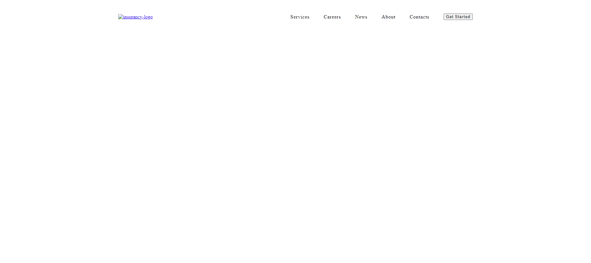

# Responsive Menu - BehinDev Task 02

This repository contains two HTML files: `before.html` and `index.html`. These files demonstrate the implementation of a responsive menu using HTML, CSS, and JavaScript.

### `before.html`

- **Menu Styling:** The menu container has a fixed width of 1152px but with a maximum width of 90% for responsiveness.
- **Navigation:** The navigation menu is horizontally aligned and consists of links for various sections such as Services, Careers, News, About, Contacts, and a Get Started button.
- **Dropdown Menu:** Hovering over the Services link reveals a dropdown menu with additional options.
- **Responsive Design:** The menu is not optimized for smaller screens and lacks responsiveness.

### `index.html`

- **Menu Styling:** The menu container remains similar to the previous version but with additional CSS variables defined for colors.
- **Navigation:** The structure of the navigation menu remains unchanged.
- **Dropdown Menu:** The dropdown menu now has a different background color and a subtle animation when it appears.
- **Responsive Design:** The major change is the implementation of a responsive design for smaller screens. The menu now adapts to different screen sizes, and the navigation items are rearranged vertically for better usability on mobile devices.
- **Hamburger Menu:** A hamburger menu icon is introduced for mobile view. Clicking on it reveals the navigation links in a vertical layout.
- **JavaScript:** JavaScript is used to toggle the visibility of the navigation menu on mobile devices and to animate the hamburger menu icon.

### Usage

1. Clone the repository or download the HTML files.
2. Open the HTML files in a web browser to view the responsive menu in action.
3. Resize the browser window to see the menu's responsiveness in action.
4. Compare the two versions (`before.html` and `index.html`) to understand the differences in implementation.

### Live Site

You can view the live site [here](https://tahabilalraza.github.io/BehinDev-task02-responsiveHeader/).

